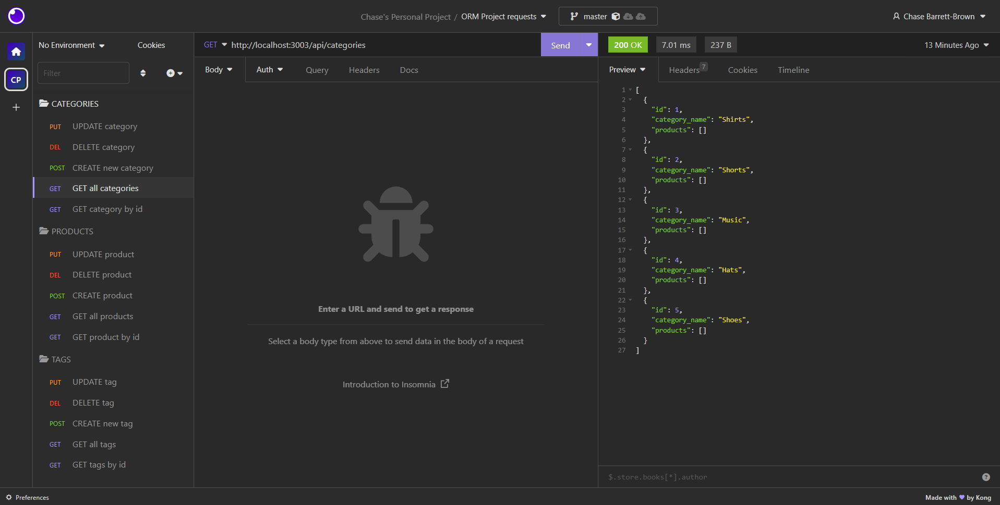

# Object Relational Mapping

## Description
This project serves as a solid foundation for building an e-commerce backend, 
providing essential endpoints and data management capabilities to support a 
robust and scalable online shopping experience.

## 
  ## Table of Contents
  - [Installation](#installation)
  - [Usage](#usage)
  - [Contributing](#contributing)
  - [Tests](#tests)
  - [Questions](#questions)
  

## Installation
- Node.js
- Express.js
- MySQL Workbench 
- dotenv
- MySQL2
- Sequelize
- Insomnia
- Visual Studio Code

## Usage
Host an online server using express.js to interact with an SQL database using api requests.

## License
N/A

## Contributing
Chase Barrett-Brown

## Tests

N/A

## Screenshot
### Insomnia requests

## Walkthrough Video

## Questions
If you have any questions, feel free to reach out to me:

GitHub: [Mrgnoblennon](https://github.com/Mrgnoblennon)

Email: chasebarrettbrown@hotmail.com

